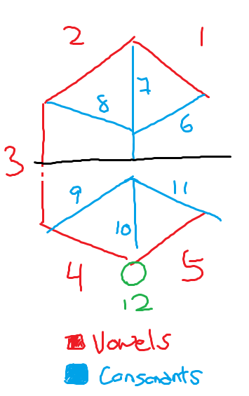

# Tunic translator

This tool uses the [CMUdict (the Carnegie Mellon Pronouncing Dictionary)](https://github.com/cmusphinx/cmudict) to retreive the phones for English words ultizing the [nltk corpus](https://www.nltk.org/_modules/nltk/corpus/reader/cmudict.html).

Symbols are provided using the [Tunic Language Reference Sheet](https://www.reddit.com/r/TunicGame/comments/tgc056/tunic_language_reference_sheet_big_spoiler/) created by Reddit user [u/oposdeo](https://www.reddit.com/user/oposdeo/).

## Tunic language

The Tunic langauge is a written language, which when read aloud is simply spoken English. As such it is identical to English in terms of grammar and vocab. Understanding the langauge is therefore simply a matter of recognizing the characters.

The characters which are comprised of 12 segments, 5 of which are used to identify a vowel, 6 for a consonant and the 12th used to determine the order of vowel and consonant in a character. Each character represents up to 1 vowel and 1 consonant, and thus, can also represent a single vowel or consonant. Multiple characters make up a word, and charaters in a word are connected by a continous horizontal line through the centre.

Below is a single character and the numbering used to refer to the segments. 



## Dependencies

NLTK
```bash
pip install nltk
```

NLTK Data
```python
import nltk

# Download CMUDict corpus (~4mb)
nltk.download('cmudict')
# Download punkt tokenizer (~35mb)
nltk.download('punkt')
```

## To-do

Add support for contractions, e.g. don't, they're, let's, you'll, etc.